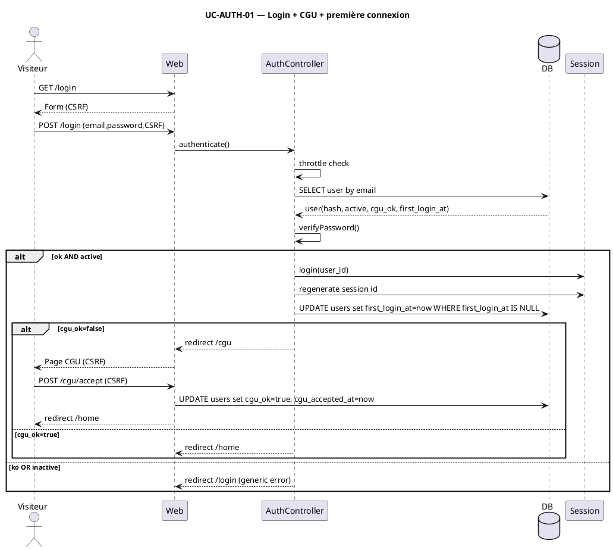
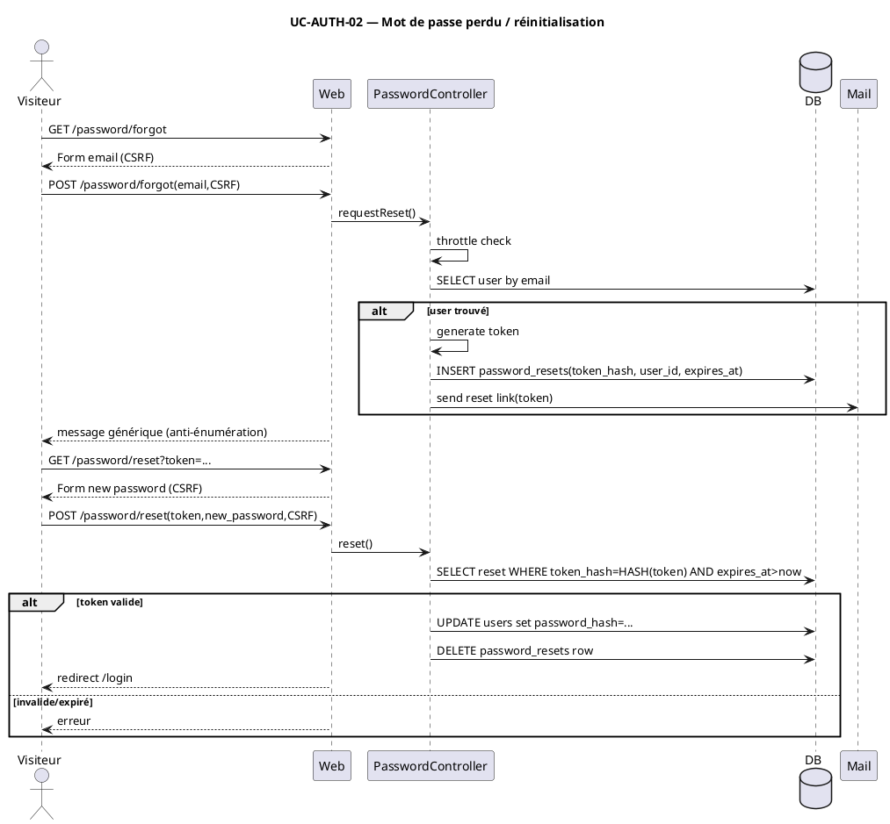
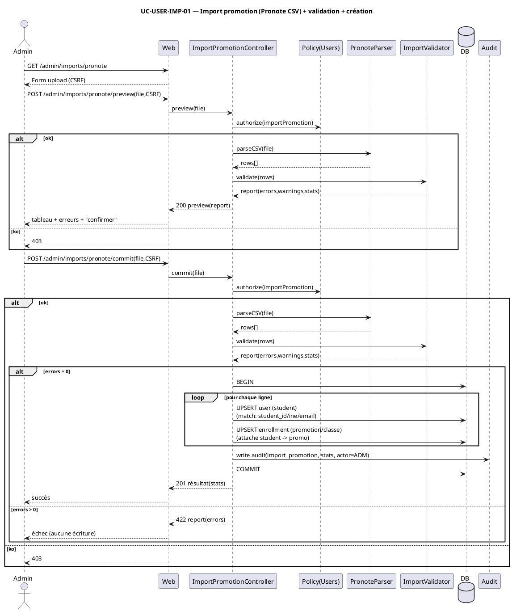
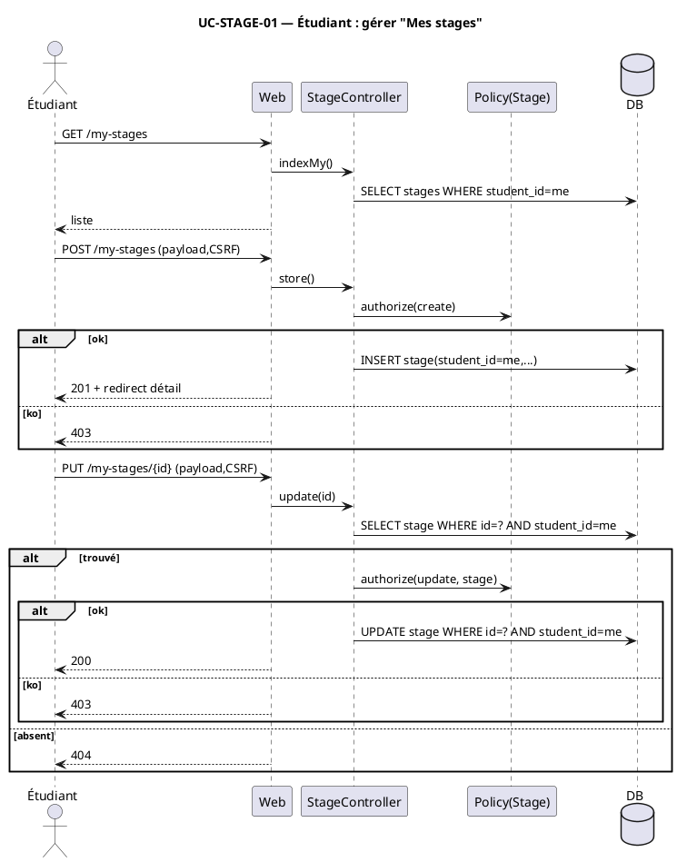
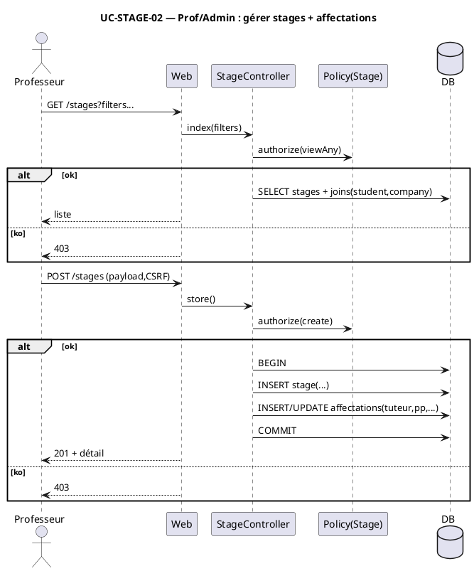
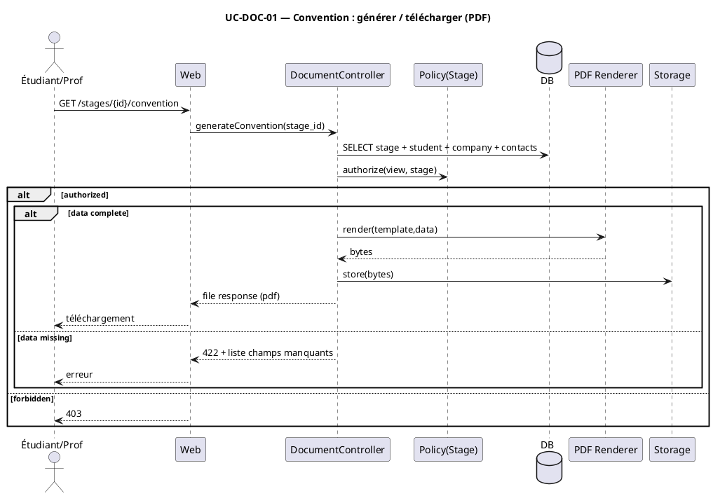
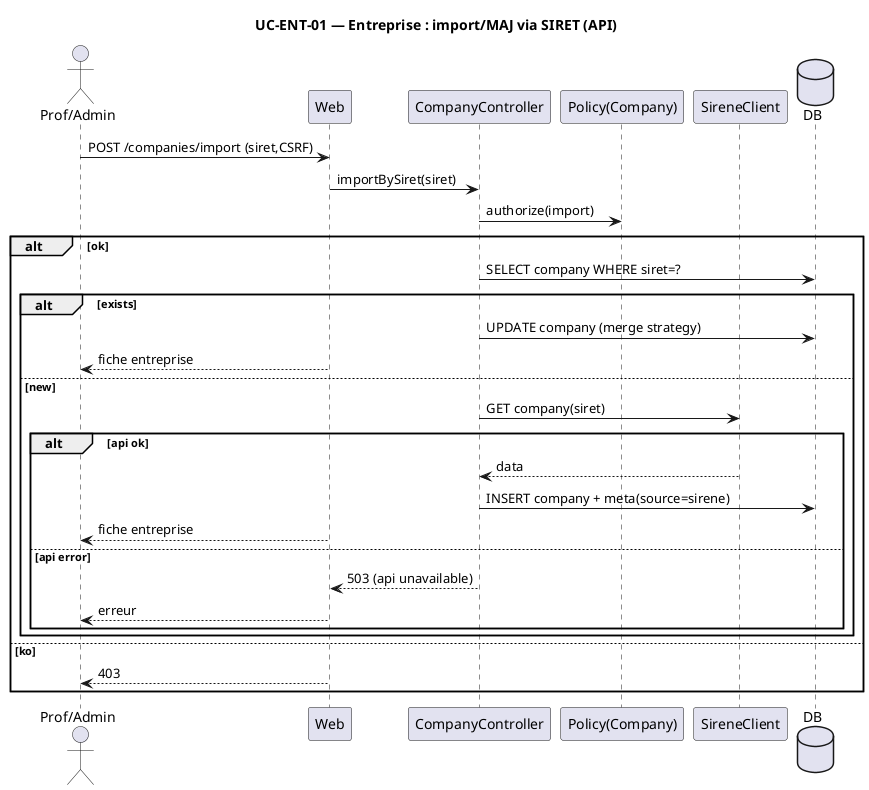
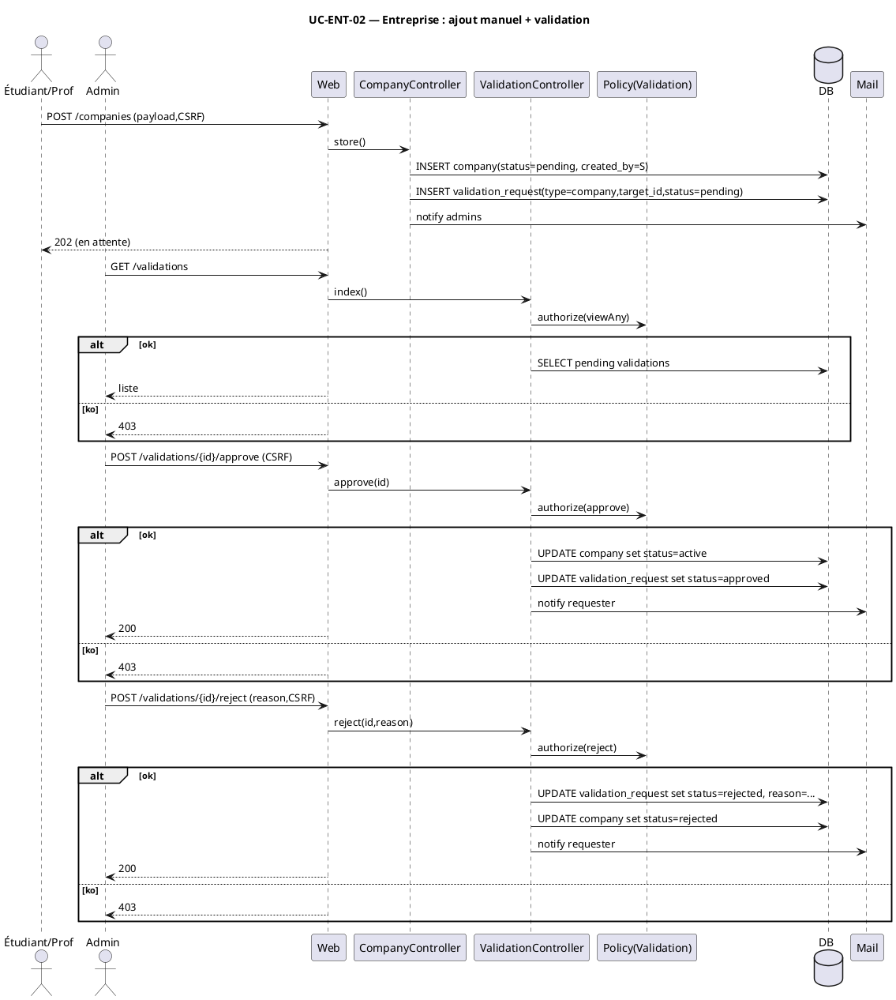
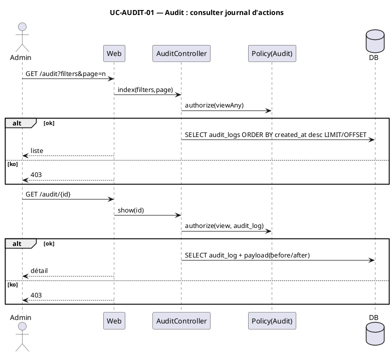

## 1. UC-AUTH-01 — Login + CGU + première connexion

![[Pasted image 20260106171208.png]]

Scénario textuel (UC-AUTH-01)

- Préconditions : utilisateur existe ; champs `password_hash`, `active`, `cgu_ok`, `first_login_at` présents.
- Déclencheur : POST `/login` avec CSRF.
- Nominal : throttle → lecture user → vérification mot de passe → contrôle `active` → ouverture session + régénération ID → `first_login_at` renseigné si NULL → si `cgu_ok=false` redirection `/cgu` puis POST `/cgu/accept` met `cgu_ok=true` et `cgu_accepted_at` → redirection `/home`.
- Alternative : identifiants invalides OU compte inactif → redirection `/login` avec erreur générique.
- Postconditions : session active ; `first_login_at` mis si absent ; CGU tracées uniquement si acceptées.

## 2. UC-AUTH-02 — Mot de passe perdu / reset

Scénario textuel (UC-AUTH-02)

- Préconditions : service mail ; table `password_resets` avec `token_hash` et `expires_at`.
- Déclencheur : POST `/password/forgot` avec CSRF.
- Nominal : throttle → recherche user → si trouvé génération token → insertion `token_hash` + expiration → envoi mail → affichage message générique → formulaire reset → POST `/password/reset` vérifie `HASH(token)` et expiration → mise à jour `password_hash` → suppression ligne reset → redirection login.
- Alternative : email inconnu → aucun insert / aucun mail ; même message générique.
- Alternative : token invalide/expiré → erreur.
- Postconditions : mot de passe modifié uniquement si token valide ; token invalidé par suppression.

## UC-USER-IMP-01 — Importer une promotion (cohorte) depuis un export Pronote.

Scénario textuel (UC-USER-IMP-01) — strictement conforme au diagramme

- Préconditions : Admin authentifié ; droit `importPromotion` ; endpoint upload actif ; CSV Pronote disponible.
- Déclencheur 1 : POST `/admin/imports/pronote/preview` avec fichier + CSRF.
- Nominal 1 (prévisualisation) : autorisation `importPromotion` → parse CSV → validation (erreurs/avertissements/stats) → retour preview.
- Déclencheur 2 : POST `/admin/imports/pronote/commit` avec fichier + CSRF.
- Nominal 2 (commit) : autorisation `importPromotion` → parse CSV → validation → si `errors=0` alors transaction DB : UPSERT étudiants (clé de correspondance définie) + UPSERT d’inscription à la promotion/classe → écriture d’audit → commit → retour succès.
- Alternative A : policy refuse (preview ou commit) → 403.
- Alternative B : validation renvoie `errors>0` au moment du commit → 422 avec report, et aucune écriture DB (pas de transaction).
- Postconditions : en succès, les étudiants sont créés/mis à jour et rattachés à la promotion ; une trace d’audit d’import existe.

## 3. UC-STAGE-01 — Étudiant gère “Mes stages”
    

Scénario textuel (UC-STAGE-01)

- Préconditions : utilisateur authentifié ; rôle étudiant.
- Déclencheur : GET `/my-stages`, POST `/my-stages`, PUT `/my-stages/{id}`.
- Nominal : liste des stages filtrée par `student_id=me` → création autorisée → mise à jour d’un stage après chargement “scopé” (`id` + `student_id=me`) et autorisation policy.
- Alternatives : create/update refusés par policy → 403 ; update sur un id non appartenant (non trouvé via scoping) → 404 ; update sur stage trouvé mais policy refuse → 403.
- Postconditions : stage créé/modifié uniquement dans le périmètre de l’étudiant.

## 4. UC-STAGE-02 — Prof/Admin : gérer stages + affectations

Scénario textuel (UC-STAGE-02)

- Préconditions : rôle prof/admin ; référentiels étudiants/entreprises disponibles.
- Déclencheur : GET `/stages`, POST `/stages` avec CSRF.
- Nominal : `viewAny` autorise la liste → création autorisée → transaction DB : insertion stage puis insertion/MAJ affectations → commit → retour détail.
- Alternatives : `viewAny` refuse → 403 ; `create` refuse → 403.
- Postconditions : aucun stage “partiel” (transaction) ; affectations cohérentes avec le stage.

## 5. UC-DOC-01 — Générer / télécharger convention
    

Scénario textuel (UC-DOC-01)

- Préconditions : stage existant ; template ; stockage disponible.
- Déclencheur : GET `/stages/{id}/convention`.
- Nominal : lecture des données → autorisation `view` → si données complètes : rendu PDF → stockage → réponse fichier.
- Alternatives : autorisation refusée → 403 ; données incomplètes → 422 + champs manquants.
- Postconditions : un PDF n’est produit que si l’accès est autorisé et les données sont complètes.

## 6. UC-ENT-01 — Import/MAJ entreprise via SIRET
    

Scénario textuel (UC-ENT-01)

- Préconditions : rôle prof/admin ; accès API ; stratégie de fusion (merge) définie.
- Déclencheur : POST `/companies/import` avec CSRF.
- Nominal : autorisation `import` → recherche par SIRET → si existe : MAJ selon stratégie → fiche ; sinon appel API → si OK insertion entreprise + meta source → fiche.
- Alternatives : policy refuse → 403 ; API en erreur → 503.
- Postconditions : entreprise créée/MAJ uniquement si autorisée ; échec API n’écrit rien.

## 7. UC-ENT-02 — Ajout manuel + validation

Scénario textuel (UC-ENT-02)

- Préconditions : états `pending/active/rejected` ; file validations ; mail opérationnel.
- Déclencheur : POST `/companies`, puis actions admin sur `/validations`.
- Nominal : création entreprise `pending` + demande de validation `pending` + notification admins → admin liste (autorisé) → approve (autorisé) : statut entreprise `active`, demande `approved`, notification demandeur.
- Alternative : admin reject (autorisé) : motif fourni, demande `rejected`, entreprise `rejected`, notification demandeur.
- Alternatives : accès validations refusé / approve/reject refusé → 403.
- Postconditions : une entreprise manuelle n’est activée qu’après approbation ; rejet laisse une trace motivée.

## 8. UC-AUDIT-01 — Journal d’actions consultable
    

Scénario textuel (UC-AUDIT-01)

- Préconditions : écritures d’audit existantes ; rôle admin.
- Déclencheur : GET `/audit` puis GET `/audit/{id}`.
- Nominal : `viewAny` autorise la liste paginée → lecture DB → affichage liste → `view` autorise le détail → lecture DB → affichage détail.
- Alternatives : `viewAny` refuse → 403 ; `view` refuse → 403.
- Postconditions : consultation possible uniquement via autorisations ; la liste est paginée (risque DoS réduit).