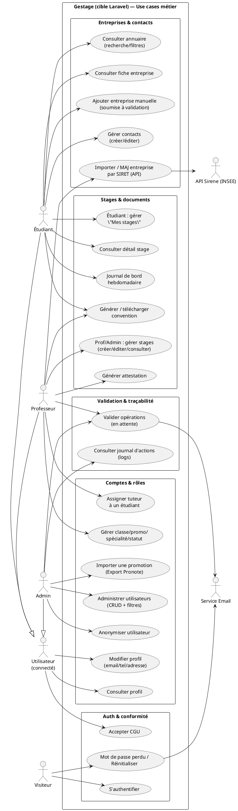

# Diagramme cas d'utilisation

```plantuml
@startuml
left to right direction
skinparam packageStyle rectangle

actor "Visiteur" as VIS
actor "Utilisateur\n(connecté)" as U
actor "Étudiant" as ETU
actor "Professeur" as PROF
actor "Admin" as ADM
actor "API Sirene (INSEE)" as SIRENE
actor "Service Email" as MAIL

ETU -|> U
PROF -|> U
ADM -|> U

rectangle "Gestage (cible Laravel) — Use cases métier" {

  package "Auth & conformité" {
    usecase "S'authentifier" as UC_AUTH
    usecase "Mot de passe perdu /\nRéinitialiser" as UC_RESET
    usecase "Accepter CGU" as UC_CGU
  }

  package "Comptes & rôles" {
    usecase "Consulter profil" as UC_PROFIL_R
    usecase "Modifier profil\n(email/tel/adresse)" as UC_PROFIL_U
    usecase "Administrer utilisateurs\n(CRUD + filtres)" as UC_USERS
    usecase "Anonymiser utilisateur" as UC_USER_ANON
    usecase "Assigner tuteur\nà un étudiant" as UC_TUTOR
    usecase "Gérer classe/promo/\nspécialité/statut" as UC_SCHOOLING
    usecase "Importer une promotion\n(Export Pronote)" as UC_PRONOTE
  }

  package "Stages & documents" {
    usecase "Étudiant : gérer\n\"Mes stages\"" as UC_MY_STAGES
    usecase "Prof/Admin : gérer stages\n(créer/éditer/consulter)" as UC_STAGE_MGMT
    usecase "Consulter détail stage" as UC_STAGE_VIEW
    usecase "Générer / télécharger\nconvention" as UC_CONVENTION
    usecase "Générer attestation" as UC_ATTEST
    usecase "Journal de bord\nhebdomadaire" as UC_JDB
  }

  package "Entreprises & contacts" {
    usecase "Consulter annuaire\n(recherche/filtres)" as UC_COMP_SEARCH
    usecase "Consulter fiche entreprise" as UC_COMP_VIEW
    usecase "Importer / MAJ entreprise\npar SIRET (API)" as UC_COMP_API
    usecase "Ajouter entreprise manuelle\n(soumise à validation)" as UC_COMP_MANUAL
    usecase "Gérer contacts\n(créer/éditer)" as UC_CONTACT
  }

  package "Validation & traçabilité" {
    usecase "Valider opérations\n(en attente)" as UC_VALIDATE
    usecase "Consulter journal d'actions\n(logs)" as UC_AUDIT
  }
}

VIS --> UC_AUTH
VIS --> UC_RESET

U --> UC_PROFIL_R
U --> UC_PROFIL_U
U --> UC_CGU

ETU --> UC_MY_STAGES
ETU --> UC_STAGE_VIEW
ETU --> UC_CONVENTION
ETU --> UC_JDB
ETU --> UC_COMP_SEARCH
ETU --> UC_COMP_VIEW
ETU --> UC_COMP_MANUAL
ETU --> UC_CONTACT

PROF --> UC_STAGE_MGMT
PROF --> UC_TUTOR
PROF --> UC_SCHOOLING
PROF --> UC_VALIDATE
PROF --> UC_CONVENTION
PROF --> UC_ATTEST
PROF --> UC_COMP_API

ADM --> UC_USERS
ADM --> UC_USER_ANON
ADM --> UC_AUDIT
ADM --> UC_VALIDATE
ADM --> UC_PRONOTE

UC_COMP_API --> SIRENE
UC_RESET --> MAIL
UC_VALIDATE --> MAIL
@enduml
```

